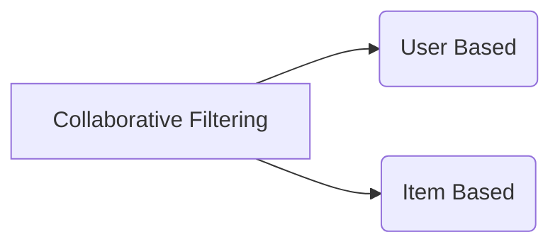

   

## Recommendation System

_Recommendation engines_ are a subclass of machine learning which generally deal with ranking or rating products / users. Loosely defined, a recommender system is a system which **predicts ratings a user might give to a specific item. These predictions will then be ranked and returned back to the user.** They’re used by various large name companies like Google, Instagram, Spotify, Amazon, Reddit, Netflix etc. often to increase engagement with users and the platform.

_Recommendation systems_ are often seen as a `black box`, the model created by these large companies are not very easily interpretable. The results which are generated are often recommendations for the user for things that they need / want but are unaware that they need / want it until they’ve been recommended to them.

## Types of Recommendation Systems

   

### Collaborative Filtering

**Collaborative filtering** filters information by using the interactions and data collected by the system from other users. It's based on the idea that people who agreed in their evaluation of certain items are likely to agree again in the future.

Most collaborative filtering systems apply the so-called similarity index-based  technique. In the neighborhood-based approach, a number of users are selected based on their similarity to the active user. Inference for the active user is made by calculating a weighted average of the ratings of the selected users.

Collaborative-filtering systems **focus on the relationship between users and items**. The similarity of items is determined by the similarity of the ratings of those items by the users who have rated both items.

### Content-Based Filtering

A recommendation system based on **content-based filtering** provides recommendations to the user by analyzing the description of the content that has been rated by the user. In this method, the algorithm is trained to understand the context of the content and find similarities in other content to recommend the same class of content to a particular user.

Let’s understand the process of content-based filtering by looking at all the steps that are involved in this method for generating recommendations for the user:

- It begins by identifying the keywords to understand the context of the content. In this step, it avoids unnecessary words such as stop words.
- Then it finds the same kind of context in other content to find the similarities. To determine the similarities between two or more contents, the content-based method uses `cosine similarities`. 
- It finds similarities by analyzing the correlation between two or more users.
- Then finally it generates recommendations by calculating the weighted average of all user ratings for active users.

## K-nearest neighbors (KNN) Algorithm

**K-nearest neighbors (KNN) algorithm** is a type of supervised ML algorithm which can be used for both classification as well as regression predictive problems. However, it is mainly used for classification predictive problems in industry.

The following two properties would define KNN well −
- **Lazy learning algorithm** − KNN is a lazy learning algorithm because it does not have a specialized training phase and uses all the data for training while classification.
- **Non-parametric learning algorithm** − KNN is also a non-parametric learning algorithm because it doesn’t assume anything about the underlying data.

### Working of KNN Algorithm

   

K-nearest neighbors (KNN) algorithm uses `‘feature similarity’` to predict the values of new datapoints which further means that the new data point will be assigned a value based on how closely it matches the points in the training set.

We can understand its working with the help of following steps −

- For implementing any algorithm, we need dataset. So during the first step of KNN, we must load the training as well as test data.
-  Next, we need to choose the value of K i.e. the nearest data points. K can be any integer.
-  For each point in the test data do the following −
   1. Calculate the distance between test data and each row of training data with the help of any of the method namely: Euclidean, Manhattan or Hamming distance. The most commonly used method to calculate distance is Euclidean.
   2. Now, based on the distance value, sort them in ascending order.
   3. Next, it will choose the top K rows from the sorted array.
   4. Now, it will assign a class to the test point based on most frequent class of these rows.
- End

## Conclusion

After trying different algorithms to make the best out of our recommendation system, Let's Watch is packed with the `Cosine Similarity Algorithm` at the top of the `K-Nearest Neighbours (KNN) Algorithm`. The website aims to give recommendations related to users' search in the best possible way.
